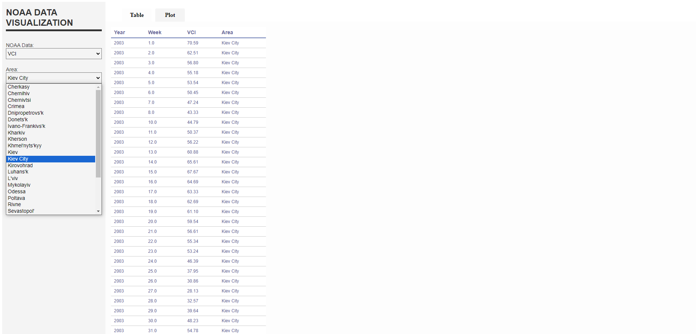
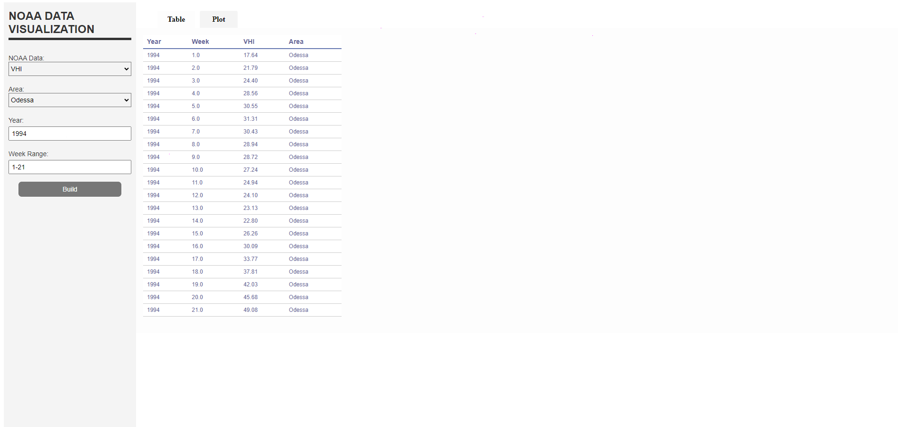
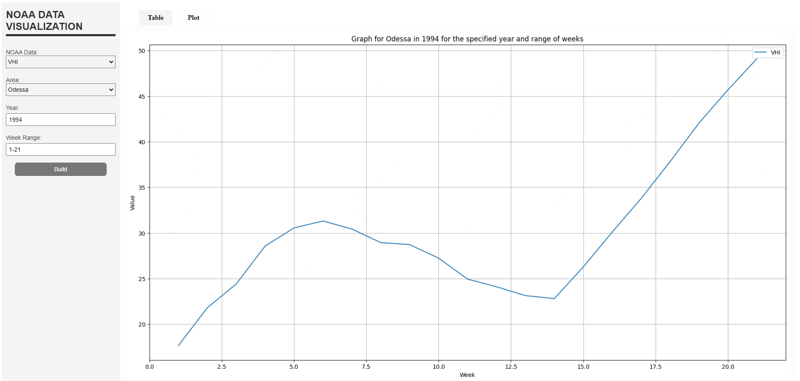

# Ukraine Climate Data Web Application

This project is a web application that allows users to visualize climate data for different regions of Ukraine. The data includes Vegetation Health Index (VHI), Vegetation Condition Index (VCI), and Temperature Condition Index (TCI). Users can select a specific year and range of weeks to view these indices and their changes over time.

## Project Overview

The project consists of two main parts:

1. **Data Collection and Processing**:
   - **Source**: Data from 1981 to 2024 is gathered from [NOAA's STAR site](https://www.star.nesdis.noaa.gov/).
   - **Process**: CSV files for each region are downloaded, cleaned, and merged into a single comprehensive CSV file (df.csv) using Pandas library. A new column is added to indicate the region for each data entry. [Link to Jupyter Notebook](csv_creation.ipynb).

2. **Web Application**:
   - **Technology**: The web application is built using gained CSV file and the Spyre library. [Link to Python Script](app_realisation.py).
   - **Features**:
     - Users can select a year and a range of weeks to view the VHI, VCI, and TCI data.
     - The application provides a graphical representation of the selected indices over time.
     - The web application runs on a local server.

## Installation

To get started with the project, follow these steps:

1. **Clone the repository**
2. **Go to the repository via the console**
3. **Run app_realisation.py**
4. **Follow the link provided in the terminal**

## Usage

1. **Select the desired index (VHI, VCI or TCI) and Region**:
   - Use the dropdown menus to choose the index and the area of Ukraine you want to view.
     
2. **Select Year and Weeks**:
   - Type needed year.
   - Type the range of weeks you want to view.

3. **View Data**:
   - The application will display the VHI, VCI, and TCI data for the selected region and time period.
   - A graph will be generated to show the changes in the selected indices over time.
  
## Screenshots

Here are some screenshots of the application:

## Conclusion

This project provides a comprehensive tool for visualizing NOAA data related to vegetation indices across different regions of Ukraine. It allows users to interactively explore and analyze data from various years and week ranges. The combination of data collection, cleaning, and visualization functionalities offers a valuable resource for understanding regional vegetation health trends.
